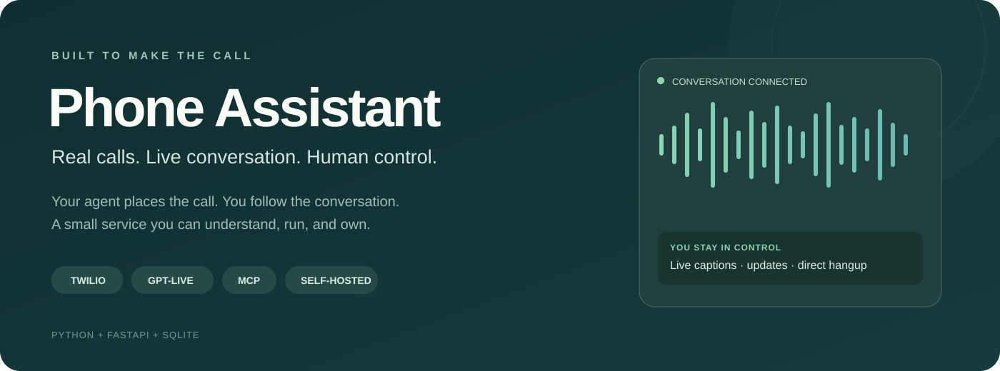
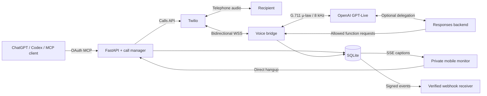
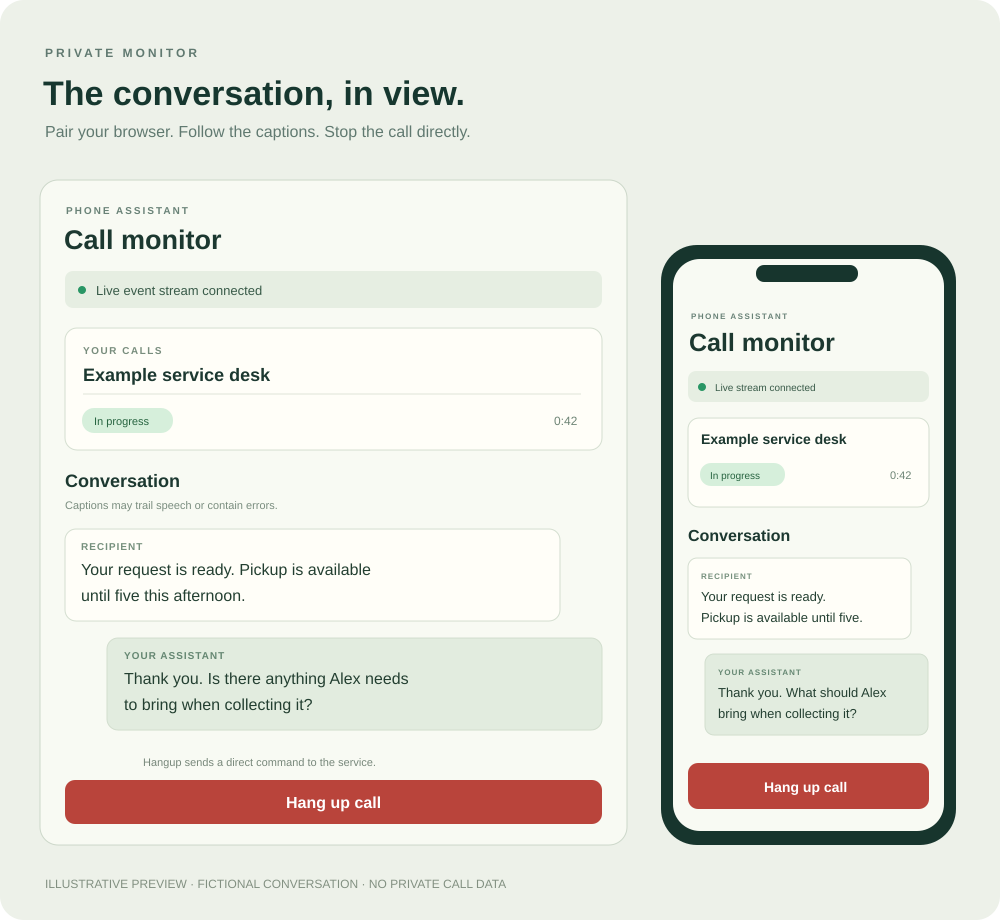

<p align="center">
  
</p>

<p align="center">
  <a href="https://github.com/i-xoxol/phone-assistant/actions/workflows/tests.yml"></a>
  
  <a href="LICENSE"></a>
  
  
</p>

<p align="center">
  <strong>A self-hosted phone assistant for ChatGPT, Codex, and other MCP clients.</strong><br>
  Twilio connects the call. OpenAI GPT-Live handles the conversation. You keep control.
</p>

<p align="center">
  <a href="docs/getting-started.md">Set it up</a> ·
  <a href="docs/architecture.md">How it works</a> ·
  <a href="docs/mcp.md">Connect an agent</a> ·
  <a href="docs/live-monitor.md">Watch a call</a> ·
  <a href="docs/troubleshooting.md">Troubleshoot</a>
</p>

## Why I built this

I wanted an assistant that could make an ordinary telephone call, work through a
phone menu, ask useful questions, and report what was actually said. Just as
important, I wanted to see the conversation as it happened and stop it myself.

This project grew from a minimal outbound-call experiment into a working private
service. It has been tested on real telephone calls, including navigating a
business phone menu and confirming an existing dental appointment. The public
release contains the implementation and reproducible instructions, with fictional
examples in place of personal details. It includes no real call transcripts,
recordings, account credentials, or access to the author's deployment.

## What you can do

| Capability | How it works |
|---|---|
| **Place a real call** | Give an E.164 number, objective, context, constraints, and duration limit. Creation returns while the call continues. |
| **Have a natural conversation** | GPT-Live listens and speaks over a continuous audio connection, with normal turn-taking and interruption support. |
| **Navigate phone menus** | Send real DTMF digits. Optionally let the in-service voice backend choose navigation keys from the menu it heard. |
| **Update a call in progress** | Send new availability, corrected facts, or a short request without restarting the conversation. |
| **Follow live captions** | Pair a phone or laptop browser with the private monitor. Transcripts stream through Server-Sent Events. |
| **Stop the call** | Use MCP, REST, or the monitor's direct hangup button. The assistant can also initiate its farewell and disconnect. |
| **Receive events** | Subscribe a verified HTTPS webhook to a call's transcript or status changes. |
| **Read the result later** | SQLite preserves call state, transcript fragments, context updates, keypad history, and diagnostic events. |

> **Scope:** a small, single-owner service. Each person runs their own instance
> with their own Twilio and OpenAI accounts. This is an MVP, not a hosted calling
> platform. Post-call summaries are currently produced by the supervising agent
> from the transcript; this service does not run an automatic summary model.

## Architecture



The application owns permissions and tool execution. GPT-Live handles the spoken
conversation; an optional Responses model handles delegated keypad and ending
requests. The originating chat does not need to poll the transcript to execute
those in-service tools. [Read the architecture walkthrough →](docs/architecture.md)

## Quick start

You need **Python 3.11+**, an owned **Twilio Voice number**, **OpenAI API billing
and GPT-Live access**, and a public **HTTPS/WSS tunnel**. A ChatGPT subscription
does not pay for API usage.

### macOS / Linux

```bash
git clone https://github.com/i-xoxol/phone-assistant.git
cd phone-assistant
python3 -m venv .venv
source .venv/bin/activate
python -m pip install -r requirements-dev.txt
cp .env.example .env
python -c "import secrets; print(secrets.token_urlsafe(32))"
```

### Windows PowerShell

```powershell
git clone https://github.com/i-xoxol/phone-assistant.git
cd phone-assistant
python -m venv .venv
.\.venv\Scripts\Activate.ps1
python -m pip install -r requirements-dev.txt
Copy-Item .env.example .env
python -c "import secrets; print(secrets.token_urlsafe(32))"
```

Put that generated token in `LOCAL_API_TOKEN`. Fill the remaining required
settings in `.env`; use your own identity in `CALLER_NAME`:

```dotenv
OPENAI_API_KEY=
TWILIO_ACCOUNT_SID=
TWILIO_AUTH_TOKEN=
TWILIO_PHONE_NUMBER=
PUBLIC_BASE_URL=
LOCAL_API_TOKEN=
CALLER_NAME=Alex
```

Start the app in one terminal, and a tunnel in another:

```bash
python -m uvicorn app.main:app --host 127.0.0.1 --port 8000 --no-access-log
```

```bash
ngrok http 8000
```

Copy the tunnel's **HTTPS origin** into `PUBLIC_BASE_URL` and restart the app.
Then check it, without placing a telephone call:

```bash
python -m scripts.preflight
python -m scripts.preflight --network
```

The network check contacts the providers and briefly opens GPT-Live; it can incur
a small OpenAI charge. It never dials. Run one Uvicorn worker and avoid reloads
during a call.

**Follow [the complete setup guide](docs/getting-started.md) before your first
call.** It covers credentials, trial restrictions, tunnel endpoints, model
permissions, and a consenting manual test.

## Example call brief

```json
{
  "phone_number": "+12025550101",
  "recipient": "Example service desk",
  "objective": "Ask whether my existing service request is complete and when pickup is available.",
  "context": "The request is under Alex. Do not change the existing request.",
  "constraints": [
    "Do not authorize any charges",
    "Do not provide payment information",
    "If a decision is needed, say you need to check with me first"
  ],
  "max_duration_minutes": 3,
  "ivr_mode": true
}
```

This number is fictional. Replace it with your consenting test recipient. The
initial brief establishes authorization; later updates can refine facts and
availability but cannot expand financial or contractual authority.

## Connect ChatGPT or Codex

Set `MCP_ENABLED=true`, restart with no active calls, and generate an OAuth
pairing code **on the machine running your service**:

```bash
python -m scripts.mcp_pairing
```

For Codex:

```bash
codex mcp add phone_assistant --url https://YOUR-PUBLIC-HOST/mcp
codex mcp login phone_assistant
```

For ChatGPT, add your `/mcp` URL as a custom MCP plugin and select **OAuth**.
Complete the owner approval page with the pairing code, install the plugin, and
enable it in the conversation. Account/workspace availability varies.

[Connection instructions and all nine tools →](docs/mcp.md)

## Your phone as a live control panel

```bash
python -m scripts.web_pairing
```

Open `https://YOUR-PUBLIC-HOST/live` and enter that code. Generate a separate
one-use code for each browser, or use **Pair mobile** from a paired laptop.
Codes expire after 15 minutes; browser sessions last seven days. Browser pairing
and MCP OAuth pairing are separate.

<p align="center">
  
  <br><sub>Illustrative preview. All conversation content is fictional.</sub>
</p>

Captions are pushed as they arrive, with replay after reconnect. They can trail
speech or contain recognition errors. The monitor uses **SSE**, not an outgoing
webhook, and its hangup button talks directly to the service.
[Monitor and emergency control details →](docs/live-monitor.md)

## Documentation

| Guide | Contents |
|---|---|
| [Getting started](docs/getting-started.md) | Provider setup, installation, tunnels, first call, acceptance checklist |
| [Configuration](docs/configuration.md) | Every environment variable, secrets, identity, model access |
| [Architecture](docs/architecture.md) | Audio transport, state, DTMF handoff, delegation, context updates, persistence |
| [API reference](docs/api.md) | REST routes, MCP tool inputs, result fields, statuses, example requests |
| [MCP and plugin setup](docs/mcp.md) | OAuth pairing, Codex, ChatGPT, plugin template, client compatibility |
| [Live monitor](docs/live-monitor.md) | Phone/laptop pairing, SSE replay, captions, hangup behavior |
| [Webhooks](docs/webhooks.md) | Native MCP Events, ordinary subscription tools, receivers, signature formats |
| [Deployment](docs/deployment.md) | Linux/systemd, persistent tunnels, reverse proxies, updates, backups |
| [Security and privacy](docs/security.md) | Data flow, controls, prompt-policy limits, private deployments |
| [Testing](docs/testing.md) | Offline test suite, optional provider checks, real-call validation |
| [Troubleshooting](docs/troubleshooting.md) | Signature errors, pairing, media failures, menus, captions, permissions |
| [Design notes and roadmap](docs/design-notes.md) | Decisions, tradeoffs, operational costs, future extension points |

## Development

```bash
python -m pip install -r requirements-dev.txt
python -m pytest -q
python -m scripts.audit_release
```

The provider-mocked test suite does not place calls and needs no real credentials.
CI runs it on Python 3.11, 3.12, and 3.14. Manual provider checks are separate.

```text
app/
  api/             REST, Twilio callbacks, live monitor
  calling/         Twilio gateway, GPT-Live bridge, prompts, allowed tools
  mcp/             OAuth MCP interface and signed event subscriptions
  storage/         SQLite schema, call records, durable event log
  web/             Mobile-friendly monitor assets
  config.py        Environment-based configuration
  main.py          FastAPI composition and process lifecycle
docs/              Replication guides and portfolio visuals
plugin/            Generic plugin template; customize for your own deployment
scripts/           Preflight, pairing, diagnostics, packaging, release audit
tests/             Mocked providers, state transitions, audio and security checks
deploy/            Example systemd unit
```

## Current limits

- Single owner and single worker; no multi-tenant isolation or production fleet management.
- No inbound calls, voicemail detection, scheduling, recording, or automatic calendar/email access.
- DTMF briefly reconnects the voice stream; it is not uninterrupted keypad injection.
- Conversation permissions are mainly prompt-based. The exposed voice tools are restricted,
  but a prompt is not a deterministic guarantee of every spoken response.
- Assistant-initiated ending uses an English/Ukrainian farewell and playback acknowledgments.
  Additional languages need their own tested ending phrase.
- A process restart preserves records but does not restore an active conversation.
- Webhook receipt is not proof that a chat or another model acted on an event.

See [design notes](docs/design-notes.md) for the exact boundaries. Use a short,
consenting test call before trusting a new deployment.

## License and contributions

Created by **Igor Khokhlov**. Released under the [MIT license](LICENSE).
Issues and focused pull requests are welcome; see [CONTRIBUTING.md](CONTRIBUTING.md).
For vulnerabilities, use [SECURITY.md](SECURITY.md). Never attach real credentials
or unredacted telephone transcripts to a public issue.
