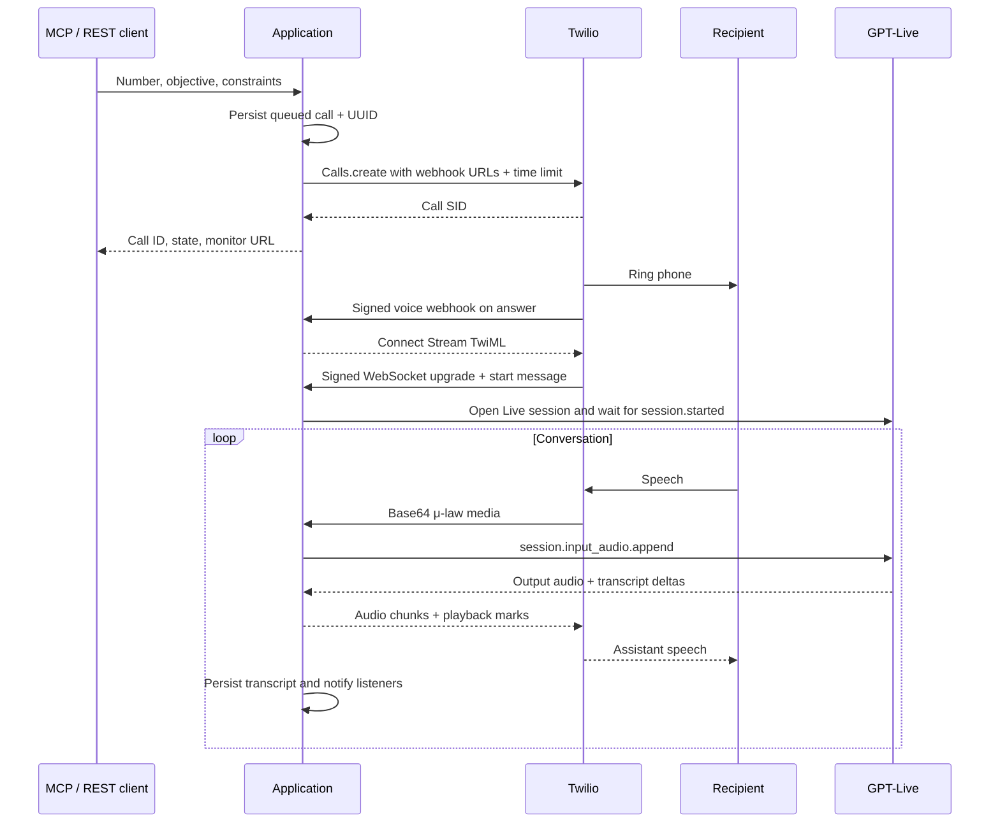

# How the service works

[← README](../README.md) · [Design notes](design-notes.md) · [API reference](api.md)

## Three control surfaces, one call manager

FastAPI owns the application. Authenticated REST and OAuth MCP both call the
same `CallManager`; the paired browser uses it for direct hangup. SQLite stores
records and event cursors. An in-process `EventHub` wakes browser and delivery
tasks after durable events are committed.

This is why the service runs **one Uvicorn worker**. The database persists data,
but active media bridges, handoff locks, and event listeners belong to a process.
Multiple workers would require coordination that this MVP intentionally lacks.

## Starting a call

The call UUID is internal; the Twilio Call SID and OpenAI session ID identify
provider resources. Creation does not block for the conversation. Signed Twilio
status callbacks report progression; callbacks may race the SDK's return, so a
validated callback can bind the SID before `calls.create` returns.

The gateway does not automatically retry creation. An ambiguous network failure
may still have placed a paid call; blind retrying can create duplicates.

## Audio bridge

The configured transport is mono **G.711 μ-law at 8 kHz** (`audio/pcmu` for Live,
`audio/x-mulaw` in Twilio's start metadata). Audio crosses the bridge without
codec conversion. Base64 is a transport representation, not an audio file;
there are no WAV headers in streaming media.

GPT-Live handles the continuous conversation and interruptions. The application
does not implement an older Realtime `response.create` voice-generation loop.
The `response.create` used by the voice-tool loop continues a **delegated
Responses backend**, not a manually segmented speech turn.

Incoming Twilio audio/marks and outgoing Live audio have independent receive
tasks. Outgoing playback is split into 100 ms chunks. Twilio mark acknowledgments
track queued playback; the outstanding queue is limited to three seconds.
Bursts wait for playback progress. A full queue stalled for three seconds
triggers an owned failure reason and hangup rather than unbounded buffering.

No custom acoustic VAD controls normal turn-taking. A small μ-law energy estimate
is used only to detect the quiet tail after the designated closing phrase.

References: [OpenAI Live WebSockets](https://developers.openai.com/api/docs/guides/voice-websockets)
and [Twilio messages](https://www.twilio.com/docs/voice/media-streams/websocket-messages).

## Who calls tools?

There are two distinct paths:

| Path | Caller | Execution |
|---|---|---|
| MCP tools | Supervising ChatGPT/Codex/other client | `CallManager` executes authenticated actions |
| In-service voice tools | GPT-Live delegates to the configured Responses backend | The backend proposes `press_digits` or `end_call`; the application validates and executes |

With `LIVE_TOOLS_ENABLED=true`, Live chooses when to delegate. The backend sees
the brief and relevant conversation context. It has two functions, not arbitrary
MCP access. `VoiceTools` collects completed function calls from nested Responses
events, validates arguments, atomically claims a tool ID in SQLite, verifies
current bridge ownership, executes, and returns verified results where the old
session is still connected. Duplicate function IDs cannot execute twice.

The voice backend cannot browse, access a calendar, read email, place another
call, pay, or purchase. A supervisor can obtain approved information through its
own tools and send a concise update. Provider delegation is documented in
[OpenAI's tools guide](https://developers.openai.com/api/docs/guides/live-delegation).

## Why keypad presses reconnect the stream

Twilio bidirectional Media Streams do not accept outbound DTMF messages from the
media server. This implementation redirects the active Call to TwiML containing
`<Play digits="...">`, followed by a new `<Connect><Stream>`.

Before redirect, the old bridge is marked as an intentional handoff and outgoing
playback is sealed. The phone call remains the same, but the media stream and
Live session reconnect. The new prompt includes prior transcript, recorded
keypad actions, and sent/acknowledged owner updates. The manager waits up to 25
seconds for the new bridge.

This is a deliberate MVP tradeoff: real keypad tones with a brief voice gap.
Do not submit competing keys during reconnect, and do not equate submitted
digits with the remote menu accepting them. A failed or ambiguous redirect is
recorded as unconfirmed and requests hangup; it is not blindly retried.

Reference: [Twilio Media Streams constraints](https://www.twilio.com/docs/voice/media-streams).

## Mid-call updates

`send_call_update` first stores a unique update ID and its content. The active
bridge injects the matching Live append event:

| Mode | Live channel | Intent |
|---|---|---|
| `context` | `session.thinking.append` | Background facts or availability |
| `say` | `session.commentary.append` | A short request to communicate aloud |
| `instructions` | `session.instructions.append` | Redirect behavior within existing limits |

Each update is 1–400 UTF-8 bytes; each call allows 20 updates. Updates queue
while ringing or reconnecting. Acknowledgments and rejection events are matched
to the client event ID and current Live session. Sent/acknowledged updates are
retained in a later keypad handoff prompt.

Retry only with the same UUID, mode, and content. A reused UUID with different
content is rejected. Acknowledged means injection succeeded, not that the model
said the words, understood them perfectly, or completed an action. Verify the
transcript. Updates cannot reverse an ending call or cancel a backend action.

## Ending and emergency control

The assistant is instructed to close with **“Thank you. Goodbye.”** or
**“Дякую. До побачення.”**. Only assistant output transcripts can trigger the
phrase detector. It waits for the final quiet audio tail, seals new playback,
and sends a final Twilio mark. After acknowledgment it finalizes Live and
disconnects Twilio, with bounded fallbacks for a stalled ending.

An in-service `end_call` request uses the same closing/playback machinery.
Duplicate end requests are ignored. New languages need a tested control phrase.
Because this is a phrase-based MVP, quoting the phrase or a long pause during a
goodbye can still cause incorrect timing.

Owner hangup is more direct: mark the call as stopping, seal output, clear queued
Twilio audio, and request provider disconnect. If Twilio cannot confirm hangup,
the app reports uncertainty while keeping outgoing speech blocked locally.
The browser calls this route directly; it does not wait for MCP polling.

Twilio also receives a provider-enforced connected-call duration limit, at most
15 minutes, so a local process failure does not create an unlimited conversation.

## Persistent records and pushed events

| SQLite table | Purpose |
|---|---|
| `calls` | IDs, brief, timestamps, state, duration, provider IDs, first voice error |
| `constraints` | Ordered restrictive constraints per call |
| `transcript_events` | Deduplicated speaker fragments and approximate timestamps |
| `keypad_events` | Digits, reasons, and submitted/unconfirmed outcomes |
| `voice_tool_operations` | Atomic tool claims and confirmed/unconfirmed state |
| `call_updates` | Idempotent update records and injection acknowledgments |
| `call_events` | Durable ordered event log for replay/delivery |
| `web_sessions`, `web_pairing` | Browser pairing and session state |
| `webhook_state` | Generic sender delivery cursor |
| `mcp_event_subscriptions` | OAuth-owned subscriptions, secrets, cursors, expiry, counters |

OAuth clients/grants are stored in a separate database. SQLite WAL supports
short concurrent reads and writes. Call state callbacks use sequence numbers
and never regress terminal states. The browser replays SQLite event IDs after
reconnecting. Webhook workers run separately from audio handling.

`completed` is a telephone status, not proof the objective succeeded. A failed
voice stream may still produce Twilio `completed`. Read `error_message`,
`voice_events`, finalization, and transcript before reporting success.

## Module map

Start with `app/main.py` for composition, `calling/call_manager.py` for actions,
`calling/live_session.py` for audio, and `storage/database.py` for persistence.
`calling/prompts.py` and `calling/tools.py` hold initial permission behavior.
API routers adapt inputs to the manager; `mcp/server.py` exposes the same actions.
The monitor is ordinary HTML/CSS/JS in `app/web`, not a frontend build pipeline.
